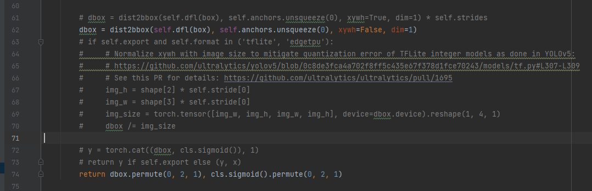
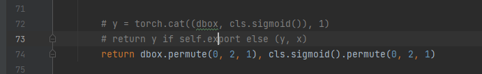
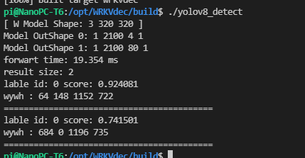
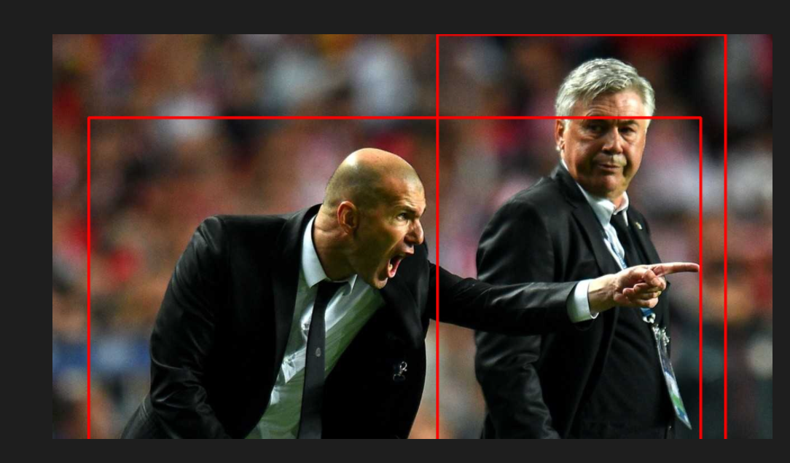

<h1 style="text-align: center">ultralytics-rknn</h1>
这个项目基于 ultralytics-yolov8， 使用其网络和预训练模型移植到Rk3588开发板上，
完成边缘设备端的`检测`, `分类`, `分割`, `姿态`等任务。

### 相关项目地址
[ultralytics](https://github.com/ultralytics/ultralytics.git): 使用的神经网络模型及权重来源 <br>
[rknpu2](https://github.com/rockchip-linux/rknpu2): rk3588驱动项目<br>
[rknn-toolkit2](https://github.com/rockchip-linux/rknn-toolkit2): rk3588模型移植相关项目<br>

### 注意事项
为了能让模型移植到`RK3588`上，对网络输出方式进行简单的修改，下方会叙述修改地方。
### 项目环境
#### 1. 服务器端 (训练/测试/转换环境onnx)
```
    python: 3.8 完全按照ultralytics原作者说明的环境
    注意: onnx==1.10.0 protobuf==3.12.2 
    这里刚开始使用protobuf环境在3.19以上出现了，转换环境加载onnx错误的情况
```
#### 2. 转换环境(rknn)
```
    均值: 0 0 0
    方差: 255 255 255
    安装rknn-toolkit2搭建即可。
```

### 3. 测试环境(RK3588)
```
    RK3588使用的固件及转换环境均是v1.5.0, 其他版本未测试。
```

## 一. 检测模型迁移
### 模型转换
#### 1. pth 2 onnx
```
   1. 运行 mytool/yolov8_det_export.py, 程序即可导出onnx模型
   对于一个320尺寸模型，对于双输出。
```
##### 

```
    代码来源: ultralytics/nn/modules/head.py line: 62
    原: dbox = dist2bbox(self.dfl(box), self.anchors.unsqueeze(0), xywh=True, dim=1) * self.strides
    改: dbox = dist2bbox(self.dfl(box), self.anchors.unsqueeze(0), xywh=False, dim=1)
    取消原先框复原时的乘法操作，这里会导致rknn推理是commit错误 (验证得到)
    并且原先直接xywh输出，因为怕同样错误，直接采用x1y1x2y2的双点输出。将xywh=False
```
##### 

```
    代码来源: ultralytics/nn/modules/head.py line: 73
    原: return y if self.export else (y, x)
    改: return dbox.permute(0, 2, 1), cls.sigmoid().permute(0, 2, 1)
    原先 只返回y，是因为将结果合并，我这里直接基于修改1，直接返回dbox和cls，并且由于原输出为 dbox[1 4 2100]在c++处理时偏移较为麻烦,所以直接
    permute将其变换为 [1 2100 4],便于c++后处理步骤
```

### RKNN测试
```
    [ cpp代码这边随便写的，只为能够最快测试流程和得到结果 ]
    // 交叉编译器自己安装，我这边使用的是aarch64-gcc10.2版本
    
    // 编译
    cd ~/test/cpp 
    mkdir build && cd build
    cmake .. && make
    
    // 运行【注意模型位置及图像路径，代码中修改】生产res.jpg
    ./u2netp_demo 
```

### 结果展示(RK3588)
```
    基于320尺寸的yolov8n检测网络，FPS可以40到50左右，单帧速度20ms。
```



## 二. 分割模型迁移
Waiting...
## 三. 姿态模型迁移
Waiting...
## 四. 跟踪模型迁移
Waiting...